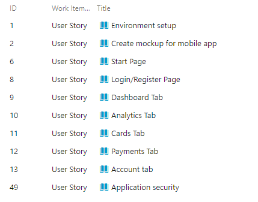
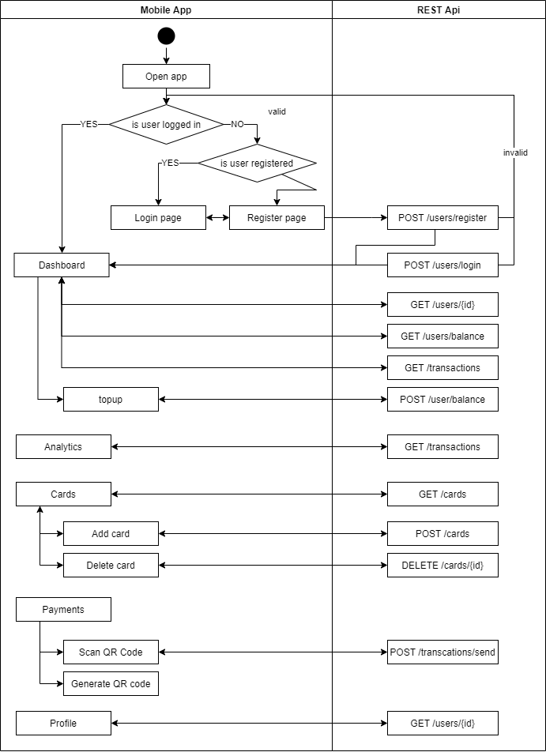

# Vanir - Procesul de dezvoltare software

## Descriere
Vanir este o aplicatie de mobile banking care permite utilizatorilor sa faca tranzactii usor si sigur. Aplicatia noastra permite incarcarea contului cu credit printr-o tranzactie cu un cont extern, istoricul tuturor tranzactiilor, analytics si punctul forte fiind tranzactiile intre utilizatorii aplicatiei care se realizeaza foarte usor prin scanarea unui cod QR.

## User stories

## UML

## Source control

Am folosit `gitflow workflow` pentru organizarea branch-urilor in feature-uri.

In principiu pentru fiecare task am creat un feature cu numele taskului si dupa finalizarea sa am initiat un merge request in `develop`. Dupa testare aceste modificari au fost aduse in `master`.

## Teste automate

Am creat 5 teste automate dintre care 3 sunt pentru integrare si 2 unitare. Testele de integrare au vizat functionalitatea din controllere, iar testele unitare au verificat functiile utilitare folosite in layerul cu baza de date.

TODO links

## Bug reporting

TODO links

## Folosirea unui build tool

Pentru partea de backend am folosit Maven (TODO link).

## Refactoring, code standards

Codurile pentru backend si frontend respecta standardele Java, respectiv Flutter/Dart.

## Design patterns

Structura aplicatiei respecta standardele `Maven` si `Spring`, iar desing patternul folosit este `Domain Driven Design`